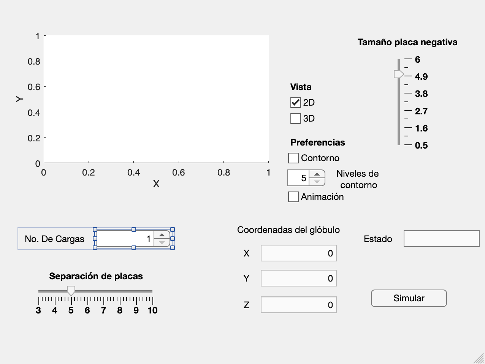

# **Malaria Diagnostic**
> *An interactive MATLAB application for simulating malaria diagnosis through electric field-based red blood cell analysis.*

## **Introduction**
Malaria Diagnostic addresses the critical need for early, accurate malaria detection, particularly in regions heavily impacted by mosquito-transmitted diseases. This MATLAB-based application leverages electric field simulations to analyze red blood cell behavior, helping to identify infected cells through an innovative dielectrophoresis approach.

## **Project Description**
- **Problem:** Mosquito-borne diseases, especially malaria, cause significant mortality worldwide, with malaria responsible for over 80% of mosquito-related deaths each year. Despite primarily affecting Africa, malaria is also a concern in countries like Mexico, where timely and accurate diagnosis is vital.
- **Solution:** This project utilizes **dielectrophoresis** to differentiate between healthy and malaria-infected red blood cells. Infected cells exhibit higher positive electric charges, allowing them to be manipulated and distinguished by the electric field.
- **Modeling Process:** MATLAB's quiver and quiver3 functions were employed to visualize electric fields in 2D and 3D, based on physical laws governing charge interactions. Adjustable parameters like plate size and charge count enable custom simulations.
- **Technologies used:** MATLAB App Designer, MATLAB graphics, 3D and 2D plotting.
- **Challenges faced:** Managing real-time visualizations and accurately simulating particle dynamics under electric field influence.
- **Future improvements:** Enhance diagnostic accuracy by refining simulation parameters, add more specific diagnostic features, and improve the app’s visualization capabilities.

## **Table of Contents**
1. [Introduction](#introduction)
2. [Project Description](#project-description)
3. [Installation](#installation)
4. [Usage](#usage)
5. [License](#license)

## **Installation**
1. **Prerequisites**:
   - **MATLAB** - [MATLAB Installation](https://www.mathworks.com/products/matlab.html)
   - **MATLAB App Designer** - Included in MATLAB R2016a and later.

2. **Clone the repository:**
   ```bash
   git clone https://github.com/ivmg5/Malaria-Diagnostic.git
   cd Malaria-Diagnostic
   ```

3. **Open the App in MATLAB:**
   Navigate to the directory and open `main.mlapp`:
   ```matlab
   open('main.mlapp')
   ```

4. **Run the App:**
   Use the **Run** button in MATLAB App Designer.

### **Configuration Options**
- **Debug Mode:** Set `DEBUG=true` in MATLAB for verbose logging.
- **Adjustable Parameters:** Modify parameters directly within the app for tailored simulations.

## **Usage**
To operate the Malaria Diagnostic app:
1. Adjust simulation parameters, such as plate separation, plate size, and charge count, via sliders and spinners.
2. Choose 2D or 3D viewing modes and enable contour visualization as needed.
3. Click **Simulate** to initiate the electric field visualization and observe the simulated red blood cell behavior.
4. Based on its position in the field, the app will classify the cell as "Infected" or "Healthy."

**Screenshots:**



## **License**
This project is licensed under the MIT License.

[](#)
[](#)
